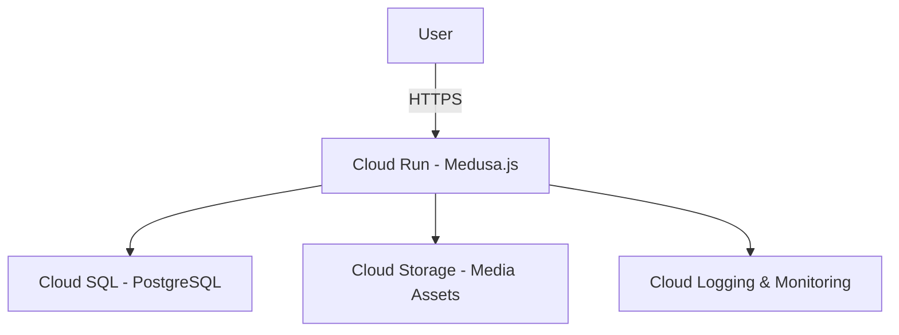

# Medusa.js on Google Cloud

This repository provides a Click-to-Deploy guide for running Medusa.js (headless commerce) on Google Cloud Platform using Cloud Run, Cloud SQL, and Cloud Storage.

## Architecture



- Cloud Run → Hosts the Medusa.js service (scales automatically).
- Cloud SQL (PostgreSQL) → Managed database backend.
- Cloud Storage → Stores product images and media.
- Cloud Logging & Monitoring → Provides observability.

## Prerequisites

- A Google Cloud Project with billing enabled
- gcloud CLI installed and authenticated
- Docker installed (for building the container)
- Basic knowledge of Node.js and Medusa.js

## Deployment Steps

1. Clone the repository
   ```bash
   git clone https://github.com/srshukla2001/medusa-storefront-highpre.git
   cd medusa-gcp-deploy
   ```

2. Enable required services
   ```bash
   gcloud services enable run.googleapis.com sqladmin.googleapis.com storage.googleapis.com
   ```

3. Create a Cloud SQL instance
   ```bash
   gcloud sql instances create medusa-db \
     --database-version=POSTGRES_14 \
     --cpu=2 --memory=4GB --region=us-central1
   ```

   Create a database and user:
   ```bash
   gcloud sql databases create medusa --instance=medusa-db
   gcloud sql users create medusa-user --instance=medusa-db --password=yourpassword
   ```

4. Create a Cloud Storage bucket
   ```bash
   gsutil mb -l us-central1 gs://your-medusa-media/
   ```

5. Build & push Docker image
   ```bash
   gcloud builds submit --tag gcr.io/$(gcloud config get-value project)/medusa-app
   ```

6. Deploy to Cloud Run
   ```bash
   gcloud run deploy medusa-service \
     --image gcr.io/$(gcloud config get-value project)/medusa-app \
     --add-cloudsql-instances $(gcloud sql instances describe medusa-db --format="value(connectionName)") \
     --region us-central1 \
     --platform managed \
     --allow-unauthenticated
   ```

7. Set environment variables (Cloud Run → Variables & Secrets)
   - DATABASE_URL=postgresql://medusa-user:yourpassword@/medusa?host=/cloudsql/PROJECT:REGION:medusa-db
   - BUCKET_NAME=your-medusa-media

8. Verify deployment  
   Open the Cloud Run service URL. You should see Medusa.js running.

## Monitoring

- Logs → Cloud Logging
- Metrics → Cloud Monitoring

## License

Apache 2.0
